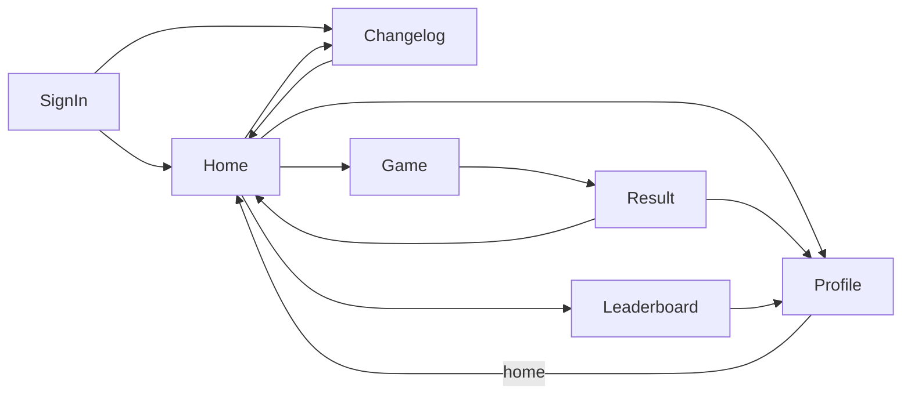

# Android UI structure

Jetpack Compose UI for the Android client. Package root: `com.rpsonline.app.ui`.

For repository layout and backend flow, see [STRUCTURE.md](STRUCTURE.md).

## Layout

```
ui/
├── RpsApp.kt              # Theme, nav, global overlays (ping, queue chip, sound, appearance)
├── auth/                  # Sign-in screen
├── home/                  # Home screen + inline queue + app info footer
├── game/                  # In-match screen + round UI + match clocks
├── result/                # Post-match screen
├── leaderboard/           # Leaderboard screen + chart/podium widgets
├── profile/               # Player profile + weekly ELO chart + match history
├── changelog/             # Release notes from GitHub
├── components/            # Shared composables
├── theme/                 # Material theme, colors, backgrounds
└── util/                  # Sound, autofill, activity helpers
```

Navigation is defined in `navigation/NavGraph.kt` (`RpsNavGraph`, `Routes`).

## App shell

| Piece | File | Role |
|-------|------|------|
| `RpsApp` | `ui/RpsApp.kt` | `RpsTheme` + `RpsNavGraph`; top bar: `FirebasePingMeter`, queue/match chip, `ClockSoundMuteButton`, `AppearanceMenuButton`; global clock ticks and round sounds via `MatchSessionMonitor` |
| `RpsNavGraph` | `navigation/NavGraph.kt` | `NavHost`, auth redirect, route wiring, match-found navigation from Home |
| `RpsTheme` | `ui/theme/Theme.kt` | Material 3 color scheme from `AppThemeStyle` |
| Screen padding | `ui/components/SafeScreen.kt` | `Modifier.rpsScreenPadding()` — safe drawing insets + top space for global overlay |

## Navigation



| Route | Constant | Arguments |
|-------|----------|-----------|
| Sign in | `sign_in` | — |
| Home | `home?matchModes={matchModes}` | optional `matchModes` (auto-queue from Play Again) |
| Game | `game/{matchId}` | `matchId` |
| Result | `result/{matchId}` | `matchId` |
| Leaderboard | `leaderboard` | — |
| Changelog | `changelog` | — |
| Profile | `profile/{userId}` | `userId` |

Signed-out users are sent to sign-in and the back stack is cleared. Home queues for a match inline; match-found navigation opens the game. Result “play again” returns to home with auto-queue for the same format. Tapping the version footer on Home or Sign-in opens the changelog.

## Screens

Top-level `@Composable` screens registered in `NavGraph`. Unless noted, screens use `Modifier.rpsScreenPadding()`.

| Screen | Package / file | ViewModel | Purpose |
|--------|----------------|-----------|---------|
| **SignInScreen** | `ui/auth/SignInScreen.kt` | `SignInViewModel`, `AppUpdateViewModel` | Google, email (sign-in / register), guest; optional update check |
| **HomeScreen** | `ui/home/HomeScreen.kt` | `HomeViewModel`, `AppUpdateViewModel` | Welcome, profile summary, online count, BO3/BO5/BO10 checkboxes, inline queue, Find Match / Reconnect / Leaderboard, sign out, app info footer |
| **GameScreen** | `ui/game/GameScreen.kt` | `GameViewModel` (per `matchId`) | Live match: pre-game countdown, round + match clocks, score, round banners, move picker |
| **ResultScreen** | `ui/result/ResultScreen.kt` | *(inline repos)* | Final score, ELO change, opponent stats, round recap; play again / home |
| **LeaderboardScreen** | `ui/leaderboard/LeaderboardScreen.kt` | `LeaderboardViewModel` | Podium + ranked list; tap row → profile |
| **ProfileScreen** | `ui/profile/ProfileScreen.kt` | `ProfileViewModel` | Stats card, weekly ELO chart, paginated match history (10 per page; own recent or shared with viewer) |
| **ChangelogScreen** | `ui/changelog/ChangelogScreen.kt` | `ChangelogViewModel` | Release notes loaded from GitHub Releases API |

### Game sub-flows (same route, inside `GameScreen`)

| UI | File | When shown |
|----|------|------------|
| **PreGameCountdownScreen** | `ui/game/PreGameCountdownScreen.kt` | Before first round; ELO matchup, skip |
| **RoundCountdown** | `ui/game/RoundCountdown.kt` | Active round deadline |
| **MatchClockDisplay** / **CircularGameClock** | `ui/game/MatchClockDisplay.kt`, `CircularGameClock.kt` | Per-player match thinking time |
| **WinRoundBanner** / **LoseRoundBanner** / **DrawRoundBanner** | `ui/game/*RoundBanner.kt` | After choices revealed; built on **RoundOutcomeCard** (`RoundBannerCommon.kt`) |
| **WaitingForOpponentCard** | `ui/game/WaitingForOpponentCard.kt` | After local move submitted |
| **MovePicker** | `ui/components/MovePicker.kt` | Rock / paper / scissors selection |
| **MatchScoreCard** *(private)* | `GameScreen.kt` | You vs opponent win count |

`GameScreen` navigates out when match status is `COMPLETED` or `ABANDONED`.

## Screen-local widgets

Composable helpers colocated with a feature (not in `components/`).

### `ui/home/`

| Widget | File | Used by |
|--------|------|---------|
| `HomeAppInfoFooter` | `HomeAppInfoFooter.kt` | Home, Sign-in — version (→ changelog), manual update check/install |
| `HomeQueueStatusCard` *(private)* | `HomeScreen.kt` | Home — queue timer while matchmaking |
| `HomeProfileSummaryCard` *(private)* | `HomeScreen.kt` | Home — wraps `ProfileSummaryStatsCard` with chevron → profile |

### `ui/leaderboard/`

| Widget | File | Role |
|--------|------|------|
| `LeaderboardPodium` | `LeaderboardPodium.kt` | Top-3 podium layout |
| `LeaderboardEntryCard` | `LeaderboardPodium.kt` | Single list row (rank, name, stats) |
| `ThrowDistributionRadialChart` | `ThrowDistributionRadialChart.kt` | R/P/S distribution ring |
| `RpsPerRoundLabel` / `PlayerThrowStatsColumn` | `RpsPerRoundLabel.kt` | Throws-per-round metric + throw breakdown |
| `LeaderboardSpectrumColor` | `LeaderboardSpectrumColor.kt` | Rank / RPS-per-win / ELO color scales |
| `leaderboardWinRateColor` | `LeaderboardWinRate.kt` | Win-rate accent color |

### `ui/profile/` *(private)*

| Widget | File | Role |
|--------|------|------|
| `WeeklyEloGainLossChart` | `WeeklyEloGainLossChart.kt` | Last 7 days of ELO change |
| `ProfileStatsCard` *(private)* | `ProfileScreen.kt` | `ProfileSummaryStatsCard` without header click |
| `MatchHistoryCard` *(private)* | `ProfileScreen.kt` | `RpsCard` + `MatchHistoryCardHeader` + embedded `MatchRecapCard` |

## Shared components (`ui/components/`)

Reused across multiple screens.

### Layout & chrome

| Widget | File | Role |
|--------|------|------|
| `rpsScreenPadding` | `SafeScreen.kt` | Standard full-screen inset modifier |
| `RpsCard` | `RpsCard.kt` | Bordered surface card; optional `onClick` |
| `RpsLoadingColumn` | `RpsLoadingColumn.kt` | Centered spinner + optional message |
| `AppearanceMenuButton` | `AppearanceMenuButton.kt` | Theme style picker (global overlay) |
| `ClockSoundMuteButton` | `ClockSoundMuteButton.kt` | Mute clock ticks and move sounds |
| `FirebasePingMeter` | `FirebasePingMeter.kt` | Firestore/`ping` latency indicator |
| `HomeOutlinedButton` | `HomeButton.kt` | Shared “Home” outlined button on secondary screens |

### Player & match stats

| Widget | File | Role |
|--------|------|------|
| `ProfileSummaryStatsCard` | `ProfileSummaryStatsCard.kt` | ELO, W–L, throw chips, optional header/chevron |
| `PlayerStatsWidget` | `PlayerStatsWidget.kt` | Thin wrapper: named header + `ProfileSummaryStatsCard` |
| `WinLossStatLine` | `WinLossStatLine.kt` | W / L / D / win-% stat line |
| `EloRatingText` | `EloRatingText.kt` | Styled ELO number |
| `ThrowCountRow` | `ThrowCountChips.kt` | Rock / paper / scissors counts |
| `PlayersOnlineLabel` | `PlayersOnlineLabel.kt` | Presence count copy |

### Match display

| Widget | File | Role |
|--------|------|------|
| `MatchRecapCard` | `MatchRecap.kt` | Per-round recap list (standalone card or embedded) |
| `RoundRecapRow` | `MatchRecap.kt` | One round: moves + outcome colors |
| `MatchHistoryCardHeader` | `MatchHistoryCardHeader.kt` | Profile history row: date, opponent, score, ELO delta |
| `MatchEloChangeLabel` | `MatchEloChangeLabel.kt` | Post-match ELO change line |
| `MatchFormat` *(functions)* | `MatchFormat.kt` | `formatMatchScore`, `formatEloDelta`, `formatMatchResultLine`, `postMatchElo` |

### Gameplay & auth

| Widget | File | Role |
|--------|------|------|
| `MovePicker` | `MovePicker.kt` | Three move buttons |
| `AppUpdateDialogs` | `AppUpdateDialogs.kt` | Optional / required update prompts |
| `AutofillTextField` | `AutofillTextField.kt` | Sign-in fields with autofill hints |
| Autofill modifiers | `AutofillModifiers.kt` | `autofillEmailAddress`, `autofillPassword`, etc. |

## Theme (`ui/theme/`)

| File | Role |
|------|------|
| `Theme.kt` | `RpsTheme(style)` — applies `colorSchemeFor` + `appBackground` |
| `Color.kt` / `ColorSchemes.kt` | Palette and per-style schemes |
| `AppBackground.kt` | Gradient / cyberpunk backgrounds per theme |
| `RpsThemeLocals.kt` | `isRpsDarkTheme()`, `currentAppThemeStyle()` |

Theme preference is persisted via `data/preferences/ThemePreferences.kt` (`AppThemeStyle`).

## Utilities (`ui/util/`)

| Helper | Role |
|--------|------|
| `MoveSoundPlayer` | `MoveSoundPlayer.kt` — rock/paper/scissors sounds after rounds |
| `ClockTickPlayer` | `ClockTickSound.kt` — match clock tick while your clock runs |
| `playMatchFoundSound` | `MatchFoundSound.kt` — queue → game transition |
| `commitAutofillSave` | `AutofillCommit.kt` — after successful sign-in |
| `findActivity` | `ActivityContext.kt` — for update install intent |
| `formatQueueTime` | `QueueTimeFormat.kt` — queue duration label |
| `NetworkUtils` | Connectivity messaging on sign-in |
| `applyImmersiveFullscreen` | `ImmersiveMode.kt` — edge-to-edge in `RpsApp` |

## Composition cheat sheet

Which shared widgets each screen uses:

| Screen | Components |
|--------|------------|
| Sign-in | `RpsLoadingColumn`, `AppUpdateDialogs`, `AutofillTextField`, `HomeAppInfoFooter` |
| Home | `ProfileSummaryStatsCard`, `PlayersOnlineLabel`, `RpsCard` (queue), `RpsLoadingColumn`, `AppUpdateDialogs` |
| Game | `MovePicker`, `RpsLoadingColumn` + game-local clocks/banners/countdown |
| Result | `RpsLoadingColumn`, `RpsCard`, `MatchRecapCard`, `MatchEloChangeLabel`, `PlayerStatsWidget`, `HomeOutlinedButton` |
| Leaderboard | `RpsLoadingColumn`, `EloRatingText`, `WinLossStatLine`, `HomeOutlinedButton` + leaderboard widgets |
| Profile | `ProfileSummaryStatsCard`, `WeeklyEloGainLossChart`, `MatchHistoryCardHeader`, `MatchRecapCard`, `RpsCard`, `RpsLoadingColumn`, `HomeOutlinedButton` |
| Changelog | `RpsLoadingColumn`, `HomeOutlinedButton` |

## Adding UI

1. **New top-level screen** — Add route in `Routes`, `composable { }` in `NavGraph`, screen file under `ui/<feature>/`, and a `ViewModel` if state is non-trivial.
2. **Reusable piece** — Prefer `ui/components/` if two or more screens need it; otherwise keep it next to the screen (see `ui/game/`).
3. **Padding** — Use `Modifier.rpsScreenPadding()` on the root column so content clears the appearance button and system bars.
